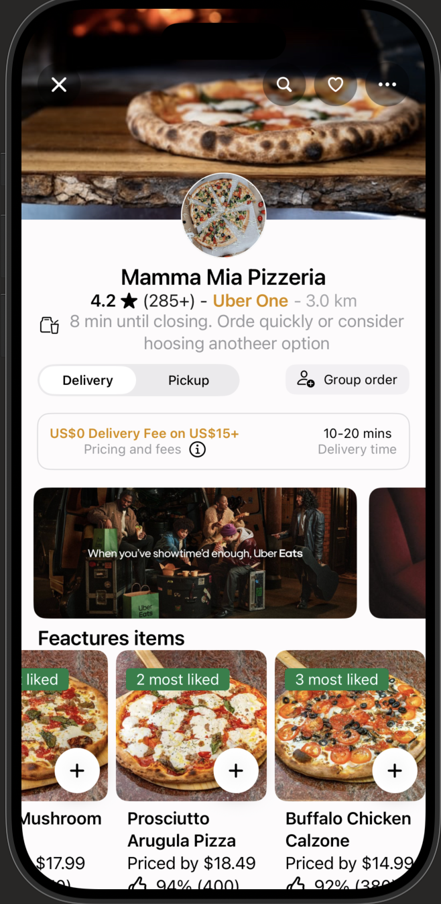
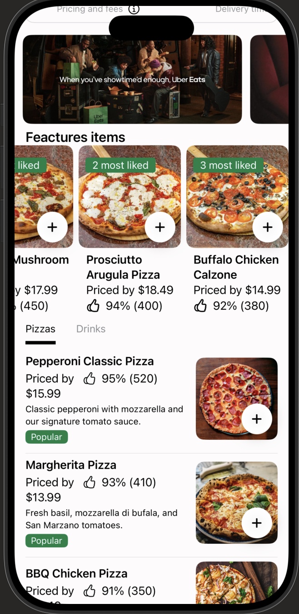
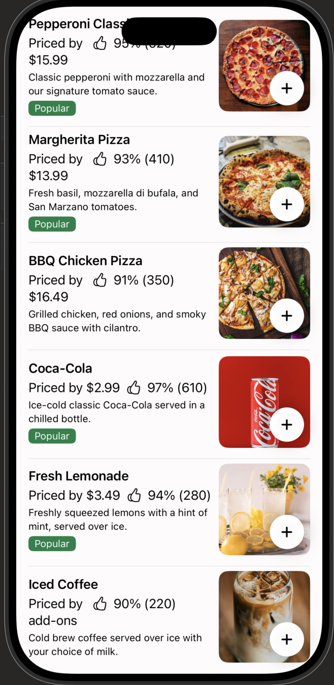

# 🍕 UberEats Clone — SwiftUI

A pixel-inspired recreation of the **Uber Eats** restaurant detail screen, built entirely with **SwiftUI** (iOS 18). This project showcases modern iOS UI development: custom layouts, scroll-driven headers, horizontal carousels, and a category-filtered menu.

<p align="center">
  
  
  
</p>

## ✨ Features

- **Restaurant header** with cover photo, circular logo, rating, distance and closing-time alert
- **Delivery / Pickup segmented toggle** and Group Order button
- **Promo banners carousel** with paging behavior
- **Featured items** horizontal scroll with "most liked" badges and quick-add buttons
- **Sticky category tabs** (Pizzas / Drinks) that filter the menu list
- **Menu list** with item photos, prices, like percentages and "Popular" tags
- Dark-mode ready & Dynamic Type friendly

## 🛠 Tech Stack

| | |
|---|---|
| Language | Swift 6 |
| UI Framework | SwiftUI (iOS 18) |
| Architecture | MVVM |
| Min. Deployment | iOS 17.0 |
| Dependencies | None — 100% native |

## 🏗 Architecture

```
UberEatsClone/
├── App/
│   └── UberEatsCloneApp.swift
├── Models/
│   ├── Restaurant.swift
│   └── MenuItem.swift
├── ViewModels/
│   └── RestaurantViewModel.swift
├── Views/
│   ├── RestaurantHeaderView.swift
│   ├── FeaturedItemsCarousel.swift
│   ├── CategoryTabsView.swift
│   └── MenuItemRow.swift
└── Resources/
    └── Assets.xcassets
```

> Adjust this tree to match your actual file structure.

## 🚀 Getting Started

1. Clone the repo
   ```bash
   https://github.com/alex-hort/UberEats
   ```
2. Open `UberEatsClone.xcodeproj` in **Xcode 16+**
3. Select an iOS 17+ simulator and press **⌘R**

## 📸 Screenshots

| Restaurant Header | Featured Items | Menu & Drinks |
|---|---|---|
|  |  |  |

## 🗺 Roadmap

- [ ] Cart & checkout flow
- [ ] Search within menu
- [ ] Animations on add-to-cart
- [ ] Unit & snapshot tests


